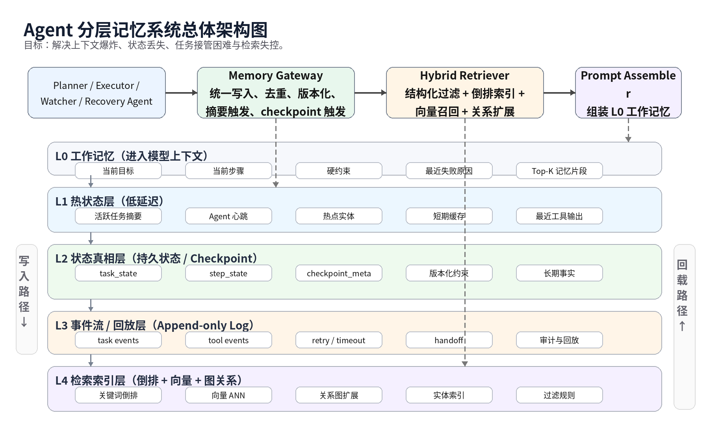
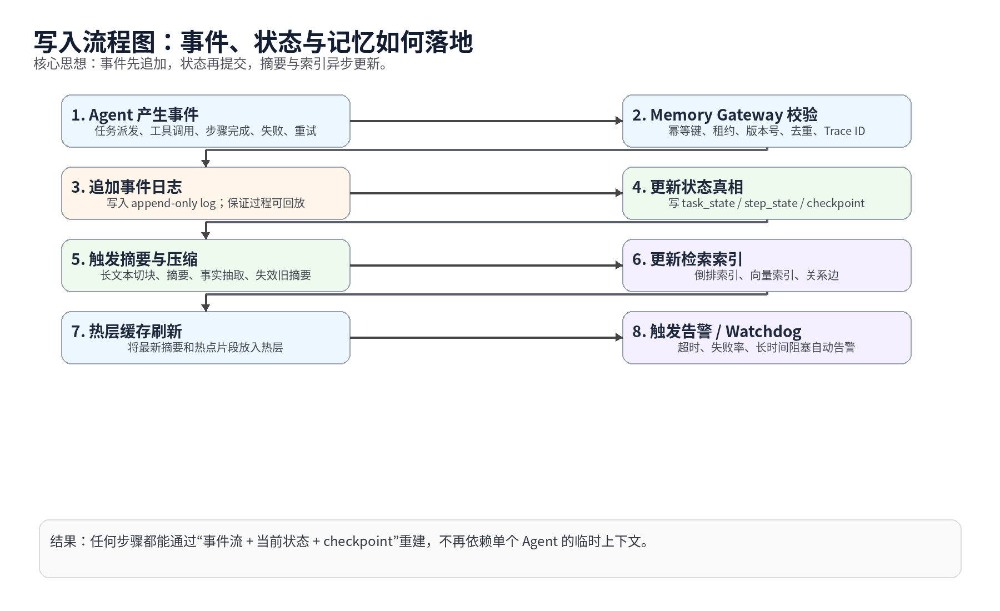
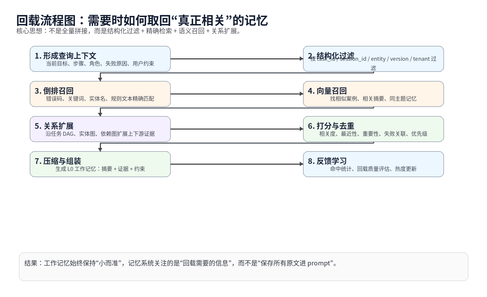
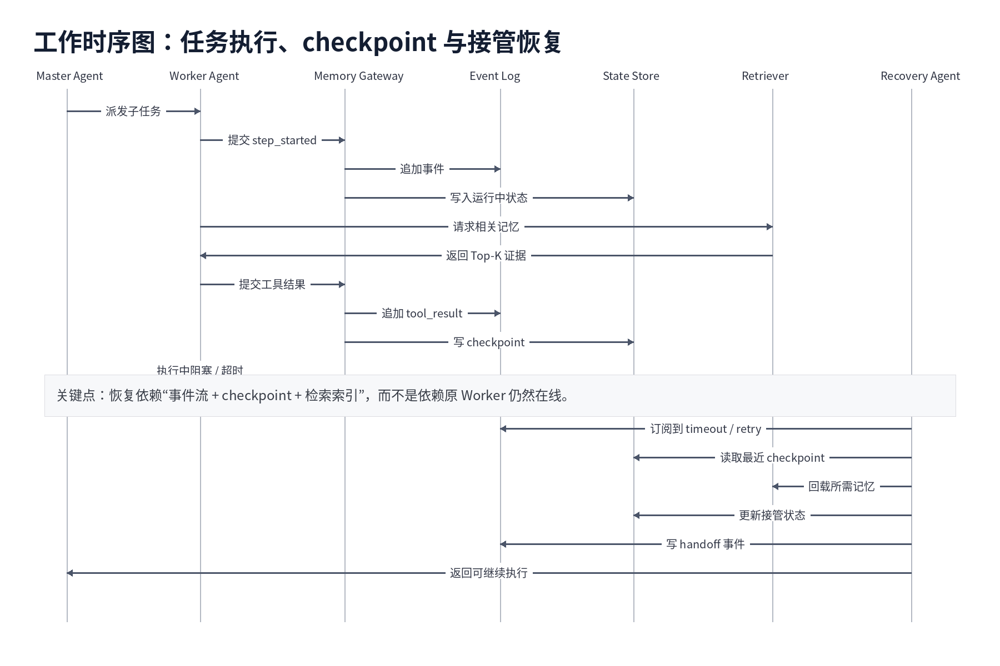

# Agent 分层记忆系统设计文档

**版本**：v1.0  
**文档类型**：架构设计 / 实施方案 / 落地路线图  
**适用对象**：分布式 Agent Runtime、长期任务执行系统、多 Agent 协同系统  
**目标**：解决上下文爆炸、记忆失控、进度丢失、任务不可接管、级联阻塞难降级等问题。

---

## 目录

1. 文档目标与设计范围
2. 核心问题定义
3. 设计原则
4. 总体架构
5. 分层记忆模型
6. 底层存储结构映射
7. 核心对象模型
8. 写入方案
9. 回载方案
10. 详细实施方案
11. 实现步骤与分阶段计划
12. 工作时序图
13. 流程图
14. 可观测性与运维
15. 风险与边界
16. 最终落地建议

---

## 1. 文档目标与设计范围

本文档将前面讨论的内容收敛为一套可工程化的 Agent 记忆系统设计方案。  
该系统不是“聊天记录存储器”，而是一个面向 **Agent Runtime** 的 **分层记忆子系统**，它需要同时承担：

- 工作记忆装配
- 长期状态落地
- 过程事件回放
- checkpoint 恢复
- 结构化与语义化检索
- 多 Agent 接管与协同
- 优先级与降级执行支撑

本文档包含：
- 完整文档化说明
- 实现步骤
- 具体详细实施方案
- 工作时序图和流程图

---

## 2. 核心问题定义

### 2.1 当前 Agent 系统常见痛点

1. **上下文爆炸**  
   会话变长、项目变大、工具输出增多后，模型 prompt 会迅速膨胀，导致成本上升、相关信息被淹没、长任务推理质量下降。

2. **多 Agent 不可观测**  
   子 Agent 卡住、重试、超时或异常退出时，父 Agent 往往只能感知“没完成”，无法知道具体阻塞点。

3. **执行进度丢失不可恢复**  
   很多系统将关键执行状态隐含在当前上下文内，一旦 Agent 重启、模型切换、节点失效，任务无法从中间状态继续。

4. **级联阻塞无法保护高优先级任务**  
   当某条支线任务长时间阻塞时，系统无法自动熔断非关键任务、释放资源、保证主线任务继续推进。

### 2.2 本系统需要直接解决的问题

- 如何让“记忆”不再等价于“全量 prompt”？
- 如何让状态从模型脑内外化为系统可恢复状态？
- 如何让其他 Agent 能在原 Agent 失效后继续运行？
- 如何在不丢失证据链的前提下，持续压缩上下文？
- 如何让检索同时兼顾精确命中、语义相似与关系扩展？

---

## 3. 设计原则

### 3.1 状态外化
所有关键执行状态必须写入系统，而不是只存在于当前模型上下文中。

### 3.2 事件优先
所有关键动作先写事件流，再写状态真相，确保过程可回放、故障可审计。

### 3.3 热冷分层
并非所有记忆都应常驻工作内存。系统必须区分：
- 当前工作记忆
- 热状态
- 持久状态
- 历史事件
- 检索索引
- 关系图谱

### 3.4 小而准的工作记忆
进入模型上下文的 L0 层必须尽量小，但必须保留最关键的信息与证据。

### 3.5 混合检索
回载不能只靠关键词，也不能只靠 embedding，必须综合：
- 结构化过滤
- 倒排索引
- 向量检索
- 关系扩展

### 3.6 可接管与可恢复
恢复与接管依赖于：
- 事件流
- checkpoint
- 当前状态真相
- 可回载记忆

---

## 4. 总体架构



### 4.1 架构分层说明

#### L0 工作记忆层
真正进入模型上下文的部分。  
仅包含：
- 当前目标
- 当前步骤
- 硬约束
- 最近失败原因
- Top-K 回载证据

#### L1 热状态层
低延迟可读写层，用于保存当前活跃信息：
- 活跃任务摘要
- Agent 心跳
- 热点实体
- 最近工具输出
- 短期缓存

#### L2 状态真相层
持久化状态层，用于保存确定性状态：
- task_state
- step_state
- checkpoint_meta
- 版本化约束
- 长期事实

#### L3 事件流 / 回放层
append-only 事件层，用于全过程回放：
- task events
- tool events
- retry / timeout
- handoff
- 审计记录

#### L4 检索索引层
用于按需回载“真正相关的记忆”：
- 倒排索引
- 向量索引
- 图关系索引
- 实体索引
- 过滤规则

---

## 5. 分层记忆模型

| 层级 | 名称 | 主要内容 | 目标 | 是否直接进 prompt |
|---|---|---|---|---|
| L0 | 工作记忆 | 当前任务最关键的信息 | 让模型本轮推理足够准确 | 是 |
| L1 | 热状态 | 活跃任务摘要、最近证据、热点数据 | 低延迟读取 | 否 |
| L2 | 状态真相 | checkpoint、任务状态、版本约束 | 恢复、接管、审计 | 否 |
| L3 | 事件流 | append-only 过程日志 | 回放、重建、追踪 | 否 |
| L4 | 检索索引 | 倒排、向量、关系图 | 按需回载 | 间接 |

### 5.1 为什么不能只做“内存 + 落盘”
因为“记忆爆炸”不是单纯容量问题，而是四个问题叠加：
- 当前工作记忆过大
- 状态更新过频繁
- 历史事件不断累积
- 检索找不回真正相关的内容

所以系统必须区分：
- **过程**
- **当前真相**
- **检索入口**
- **进入 prompt 的最小证据集合**

---

## 6. 底层存储结构映射

这一节不再以某个具体数据库产品为中心，而是提炼可复用的底层思想。

| 存储思想 | 典型结构 | 最适合解决的问题 | 在本系统中的作用 |
|---|---|---|---|
| Append-only Log | 分段日志、顺序追加、偏移量 | 进度不丢、过程可回放、故障接管 | L3 事件流 |
| B+ 树 / 聚簇索引 | 主键查询、范围扫描、稳定随机读 | 当前状态真相、checkpoint 元数据、版本状态 | L2 状态真相层 |
| LSM-tree | 先写内存，再刷盘，再合并 | 高频写入、冷热下沉、写放大优化 | 高频 checkpoint / 状态更新场景 |
| 倒排索引 | term -> documents | 关键词、规则、实体名、错误码精确召回 | L4 精确检索 |
| 向量索引 | ANN / HNSW 等 | 相似案例、语义相关片段 | L4 语义召回 |
| 图结构 | 节点 / 边 / 路径扩展 | 依赖图、因果链、任务关系、实体关系 | L4 关系扩展 |

### 6.1 设计判断

#### 日志结构解决什么
解决的是 **执行过程丢失**。  
它让系统知道“发生过什么”。

#### B+ 树 / 状态表解决什么
解决的是 **当前到底进行到哪里**。  
它让系统知道“现在是什么状态”。

#### 倒排 + 向量解决什么
解决的是 **回忆时如何找到真正相关的信息**。  
它让系统知道“要把什么装回上下文”。

#### 图结构解决什么
解决的是 **任务之间、实体之间、失败原因之间如何关联**。  
它让系统知道“哪些信息虽然没有关键词命中，但关系上强相关”。

---

## 7. 核心对象模型

### 7.1 逻辑对象

| 对象 | 说明 | 核心字段 |
|---|---|---|
| Task | 一个可调度任务 | task_id, parent_task_id, priority, deadline, state |
| Step | Task 内的执行步骤 | step_id, task_id, agent_id, status, retry_count |
| Checkpoint | 可恢复快照 | checkpoint_id, task_id, step_id, version, input_ref, output_ref |
| Event | append-only 事件 | event_id, trace_id, event_type, task_id, step_id, payload |
| MemoryChunk | 可检索记忆块 | chunk_id, scope, summary, source_ref, importance |
| Constraint | 约束项 | constraint_id, scope, version, text, hard_or_soft |
| Entity | 实体节点 | entity_id, entity_type, name |
| Relation | 关系边 | src_id, dst_id, relation_type, weight |

### 7.2 关键 ID 体系
- trace_id：一次完整任务链路的全局追踪
- session_id：一次会话或一次项目上下文空间
- task_id：一个独立任务
- step_id：任务步骤
- agent_id：执行者
- checkpoint_id：恢复锚点
- memory_chunk_id：检索对象

---

## 8. 写入方案



### 8.1 写入路径原则

1. 事件先写  
2. 状态再提交  
3. checkpoint 定点保存  
4. 摘要与索引异步更新  
5. 热层只缓存最新且高价值的结果  

### 8.2 标准写入动作

#### 任务开始时
- 生成 task_id / trace_id
- 写入 `task_created`
- 初始化 `task_state = queued`

#### 步骤启动时
- 写入 `step_started`
- 更新 `step_state = running`
- 记录 agent 租约与开始时间

#### 工具调用后
- 将工具结果写入事件流
- 根据阈值判断是否写 checkpoint
- 对长文本结果进行分块和摘要

#### 步骤完成时
- 写入 `step_completed`
- 更新状态真相
- 更新热层摘要与命中热度

#### 超时 / 重试 / 失败时
- 写入对应事件
- 触发 watchdog
- 记录失败原因、关联实体和待回滚项

### 8.3 为什么必须“事件先写，状态后写”
因为事件流是系统对“发生过什么”的最原始记录；  
状态表只是当前真相的压缩投影。  
如果没有事件流，接管时往往只能看到“现在是什么”，看不到“是怎么走到这里的”。

---

## 9. 回载方案



### 9.1 回载目标
系统回载的不是“全部历史”，而是：
- 当前最相关的证据
- 约束
- 最近失败原因
- 上下游关键状态
- 需要避免重复执行的结果

### 9.2 标准回载流程

#### 第一步：形成查询上下文
由当前任务状态构造回载请求：
- 当前目标
- 当前步骤
- 当前角色
- 最近失败原因
- 用户约束
- 任务优先级
- 依赖链

#### 第二步：结构化过滤
先做范围裁剪：
- session_id
- task_id
- entity_id
- version
- tenant
- role_scope

#### 第三步：精确召回
使用倒排层找：
- 错误码
- 工具名
- 规则条目
- 明确提到的实体
- 文本约束

#### 第四步：语义召回
找相似案例：
- 相似步骤摘要
- 相似失败案例
- 相似工具输出
- 同主题记忆块

#### 第五步：关系扩展
沿关系图补充：
- 上游任务
- 下游依赖
- 同实体关联记录
- 失败影响链

#### 第六步：打分去重
统一打分：
- 相关度
- 最近性
- 重要性
- 失败关联
- 优先级
- 可信度

#### 第七步：压缩组装
生成 L0 工作记忆：
- 当前目标摘要
- 关键证据 3~7 条
- 最近失败原因
- 硬约束清单
- 当前执行边界

---

## 10. 详细实施方案

### 10.1 子系统拆分

| 子系统 | 职责 | 输入 | 输出 |
|---|---|---|---|
| Memory Gateway | 统一写入、幂等、版本校验 | Agent 事件 | 事件、状态、摘要任务 |
| Event Logger | 事件持久化 | 事件对象 | append-only event log |
| State Store | 当前状态真相 | 状态更新命令 | task/step/checkpoint 状态 |
| Summarizer / Compactor | 长文本压缩、事实抽取 | 原始事件、工具输出 | summary / facts / chunk |
| Indexer | 更新倒排、向量、关系索引 | 摘要、实体、关系 | queryable index |
| Retriever | 混合检索 | query context | Top-K memory set |
| Prompt Assembler | 组装 L0 工作记忆 | Top-K memory + state | prompt context |
| Watchdog | 超时、阻塞、失败率检测 | 事件与心跳 | 告警 / 接管 / 重试 |
| Recovery Manager | 接管与恢复 | checkpoint + event log | 恢复任务 |

### 10.2 逻辑数据面

#### 事件面
记录全过程，必须 append-only。

#### 状态面
记录当前真相，允许覆盖更新，但必须保留版本号与更新时间。

#### 索引面
由异步任务维护，可重建，不应成为唯一真相来源。

#### 热层面
面向低延迟访问，但不作为唯一持久来源。

### 10.3 checkpoint 设计建议

每个 checkpoint 至少包含：

- checkpoint_id
- task_id
- step_id
- plan_version
- constraint_version
- last_event_offset
- input_refs
- output_refs
- retry_context
- next_actions
- handoff_ready_payload

### 10.4 写入触发策略

| 触发点 | 是否写事件 | 是否写状态 | 是否写 checkpoint |
|---|---|---|---|
| task created | 是 | 是 | 否 |
| step started | 是 | 是 | 否 |
| tool result small | 是 | 是 | 视情况 |
| tool result large | 是 | 是 | 是 |
| step completed | 是 | 是 | 是 |
| retry / timeout | 是 | 是 | 是 |
| handoff | 是 | 是 | 是 |

### 10.5 记忆压缩策略

#### 原文不直接进热层
原始输出保存在持久层或对象存储中，热层保留：
- 摘要
- 关键事实
- 溯源引用
- 命中热度

#### 摘要必须带版本
因为摘要本身会随任务进度被重写。必须有：
- summary_version
- based_on_event_range
- confidence
- invalidated_by

### 10.6 打分函数建议

可定义统一的回载打分模型：

```text
MemoryScore =
  a * semantic_relevance +
  b * keyword_match +
  c * recency +
  d * importance +
  e * failure_association +
  f * dependency_weight +
  g * trust_score
```

---

## 11. 实现步骤与分阶段计划

### 阶段 0：对象模型与状态机
目标：先统一语言。  
交付：
- Task / Step / Event / Checkpoint schema
- TaskState / StepState 枚举
- trace_id 规则
- 幂等键规则

### 阶段 1：事件流 + 状态真相层
目标：先解决“进度不丢”。  
交付：
- append-only event log
- task_state / step_state 持久化
- checkpoint 写入能力
- watchdog 基础版

### 阶段 2：摘要与索引
目标：先解决“上下文不能全塞”。  
交付：
- 长文本分块
- 摘要器
- 倒排索引
- 语义索引
- Top-K 回载接口

### 阶段 3：热冷分层
目标：降低 prompt 膨胀和读写成本。  
交付：
- 热层缓存
- 热度更新策略
- 冷层归档
- 失效摘要清理

### 阶段 4：接管与恢复
目标：让别的 Agent 能接着跑。  
交付：
- handoff payload
- lease / heartbeat
- timeout detection
- recovery manager
- 从 checkpoint 恢复

### 阶段 5：优先级与降级执行
目标：保证主线任务。  
交付：
- priority / deadline
- non-critical task drop policy
- degrade mode
- circuit breaker

### 阶段 6：全链路可观测
目标：让系统真正可运维。  
交付：
- metrics
- logs
- traces
- live task board
- blocked reason 面板

---

## 12. 工作时序图



### 12.1 时序说明

1. Master Agent 派发子任务给 Worker Agent  
2. Worker Agent 通过 Memory Gateway 写入 `step_started`  
3. Gateway 将事件写入事件流，再更新状态层  
4. Worker 需要上下文时，Retriever 返回 Top-K 证据  
5. Worker 执行过程中持续写入工具结果与 checkpoint  
6. 若发生超时或阻塞，Watchdog / Recovery Agent 订阅到异常事件  
7. Recovery Agent 读取最近 checkpoint，重新回载所需记忆  
8. Recovery Agent 更新 handoff 状态并继续执行

### 12.2 设计要点
- 恢复依赖系统状态，不依赖原 Agent 仍然存活
- 所有接管动作都必须留下 handoff 事件
- checkpoint 是接管的锚点，事件流是上下文补全来源

---

## 13. 流程图

### 13.1 写入流程


### 13.2 回载流程


### 13.3 流程理解要点

#### 写入流程强调
- 先记录过程
- 再落当前真相
- 再做摘要和索引

#### 回载流程强调
- 先裁范围
- 再多路召回
- 再统一打分
- 最后压缩成工作记忆

---

## 14. 可观测性与运维

### 14.1 必须监控的指标

| 指标 | 说明 |
|---|---|
| task_latency | 任务总耗时 |
| step_latency | 步骤耗时 |
| checkpoint_interval | checkpoint 间隔 |
| retrieval_hit_rate | 回载命中率 |
| prompt_token_size | L0 工作记忆大小 |
| summary_compression_ratio | 摘要压缩率 |
| timeout_count | 超时次数 |
| retry_count | 重试次数 |
| handoff_count | 接管次数 |
| stale_memory_ratio | 过期摘要比例 |

### 14.2 必须具备的面板
- 活跃任务看板
- 子任务依赖图
- 阻塞原因分布
- 最近失败事件流
- 接管恢复记录
- 回载质量分析

### 14.3 告警建议
- 长时间无心跳
- task stuck 超过阈值
- step retry 连续过多
- 回载命中率持续过低
- L0 工作记忆大小异常上升
- checkpoint 长时间未刷新

---

## 15. 风险与边界

### 15.1 不要把热层当唯一真相
热层适合快读快写，不适合做唯一持久源。

### 15.2 不要只做 embedding 检索
如果没有倒排和结构化过滤，很多规则、错误码、实体关系会找不准。

### 15.3 不要把 checkpoint 做成“大快照黑盒”
checkpoint 需要可解析、可回载、可重建，否则接管时仍然需要重跑大量步骤。

### 15.4 不要把摘要当原文
摘要是为了压缩，不是为了替代证据。必须保留原始引用。

### 15.5 不要让所有任务平权
必须从一开始就支持：
- priority
- deadline
- critical / non-critical
- degrade policy

---

## 16. 最终落地建议

### 16.1 一句话总结
这个系统不是“保存聊天记录”的数据库，而是一个：

**日志驱动、状态落地、混合检索、可接管恢复的 Agent 记忆运行时。**

### 16.2 最小可落地闭环
如果只做第一版，建议优先完成以下闭环：

1. 统一事件模型
2. 当前状态真相层
3. checkpoint
4. 摘要器
5. 倒排 + 向量双检索
6. L0 工作记忆组装器
7. watchdog + recovery manager

### 16.3 最终目标
达到下面这个能力水平：

- 大任务能长时间运行
- 子任务阻塞可见
- 进度可恢复
- 其他 Agent 可接管
- 工作记忆始终保持小而准
- 重要任务在阻塞时仍可被优先保障

---

## 附录 A：推荐的实现顺序

```text
Schema & State Machine
    -> Event Log
    -> State Store
    -> Checkpoint
    -> Summarizer
    -> Inverted Index
    -> Vector Index
    -> Retriever
    -> Prompt Assembler
    -> Watchdog
    -> Recovery Manager
    -> Priority / Degrade Controller
```

## 附录 B：一句工程化判断

记忆爆炸不是单一数据库问题，而是以下四类问题叠加：

- 过程如何保留
- 当前真相如何落地
- 需要时如何找回
- 复杂依赖如何延续

因此系统底座应当抽象为：

```text
Log + State Store + Retrieval Index + Relation Graph
```
